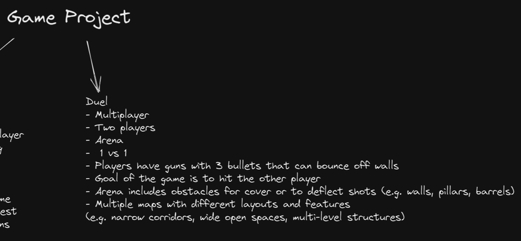

#  Python Project

The basis of the project - https://github.com/techwithtim/Network-Game-Tutorial

Sprites and Sounds - https://opengameart.org/content/space-shooter-art

Game Inspiration - https://www.youtube.com/watch?v=AlCJc05nkwc

# Instruction

## Keybinds ⌨️

- W - move up
- A - move left
- S - move down
- D - move right

- LMB 🖱️ - Shoot 💥
- Space - Dash

## Running Game

One computer on local network must run server.py 🖥️ and the others need to execute run.py 💻

It is recommended to use virtualenv and install packages using pip install -r requirements.txt.

To ensure optimal gameplay, both players and the server should be connected to the same network. If the game is not being played locally on one computer, when starting the server, enter your IPv4 address. Then, when running run.py, enter the same address as the server.

## Game Description 🎮

In this game, players can earn points by shooting the second player. The player with the highest score at the end of the round is declared the winner. If a player is killed, a new round begins on a randomly selected map. The game continues until one player reaches 5 points, at which point they are declared the winner 🥇.

## Skin Names

- playerShip1_blue

- playerShip1_green

- playerShip1_orange

- playerShip1_red

- playerShip2_blue

- playerShip2_green

- playerShip2_orange

- playerShip2_red

- playerShip3_blue

- playerShip3_green

- playerShip3_orange

- playerShip3_red

- ufoBlue

- ufoGreen

- ufoYellow

- ufoRed

